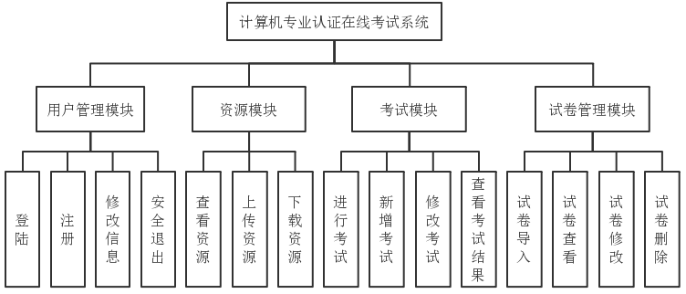
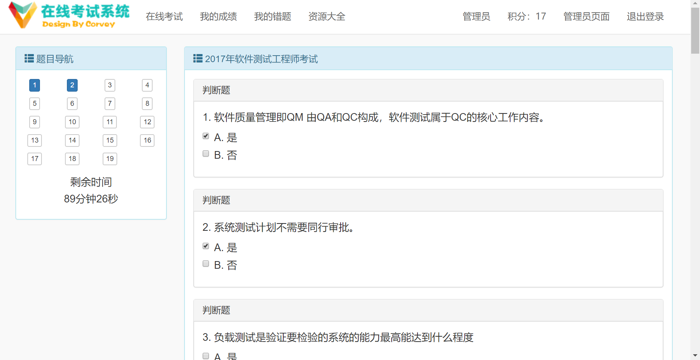
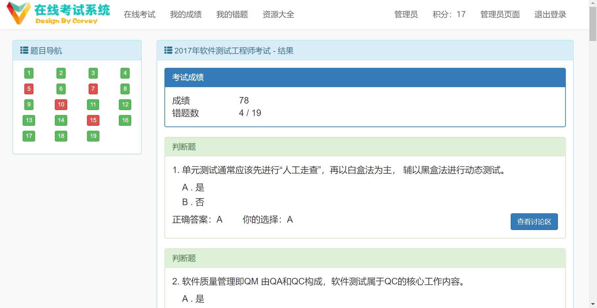
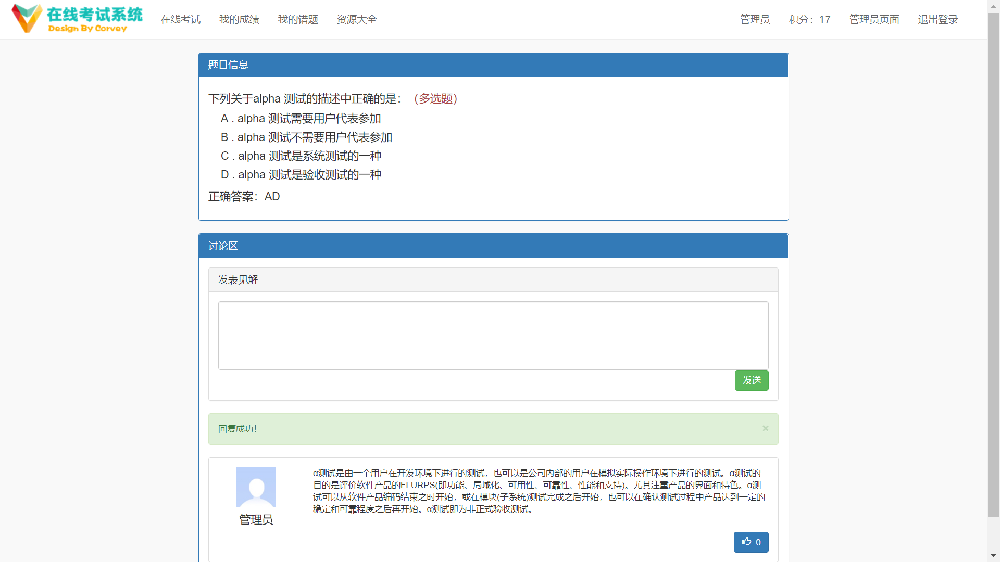
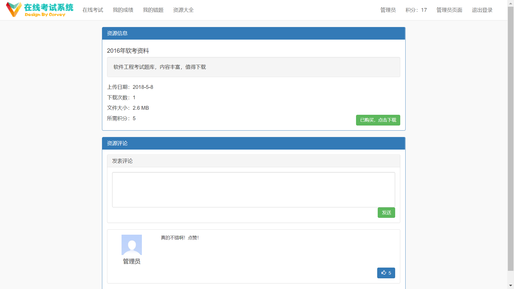
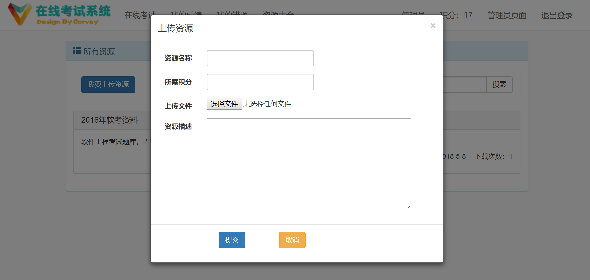
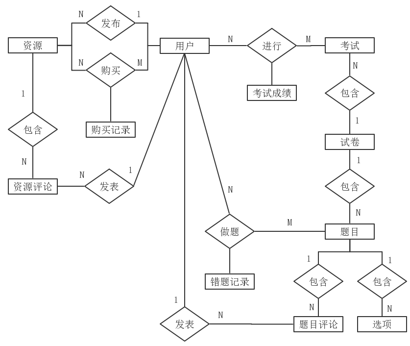

# 计算机专业认证在线考试系统

毕业设计，个人独立完成

## 功能模块图

## 技术选型

* 前端
  * Html/Css/JavaScript
  * Bootstrap
  * jQuery
  * UploadFive
* 后端
  * Spring/SpringMVC/Hibernate
  * Spring Security
  * slf4j/log4j
  * Gson
  * POI
  * Druid
* 数据库
  * MySQL

## 界面展示

## ER图

## 项目包结构

* src.main
  * java
    * pers.corvey.exam
      * controller
        * common
        * sys
      * service
        * common
        * sys
      * dao
      * entity
        * common
        * sys
        * ui
      * support
        * form
        * hibernate
        * security
      * exception
      * utils
  * resources
  * webapp
    * common
    * static
      * css
      * fonts
      * img
      * js
    * WEB-INF
      * views
        * sys
        * exception
      